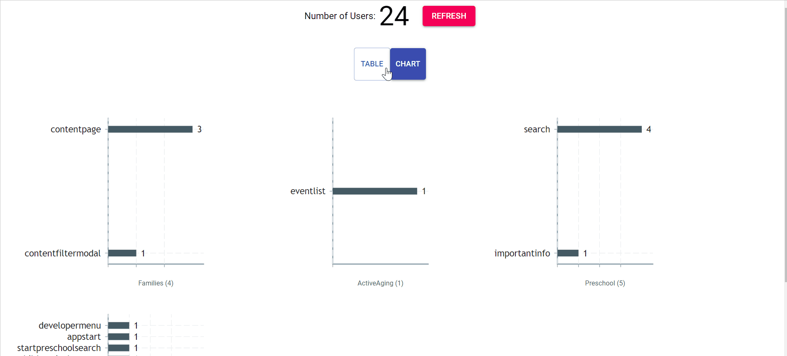
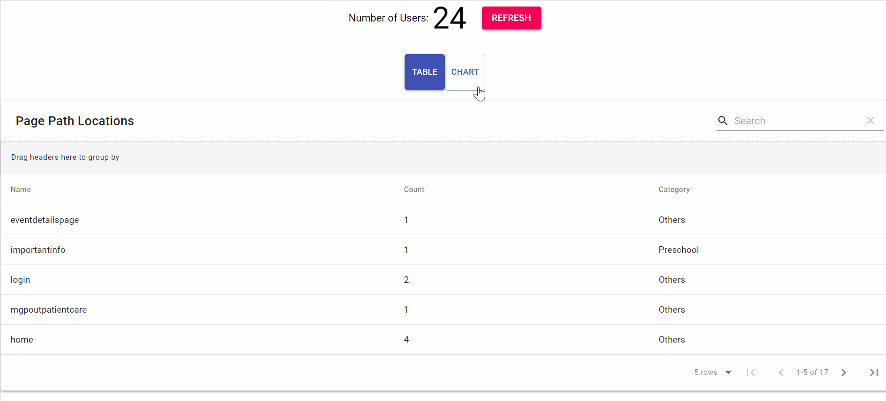

# Set up instructions

1. Install the dependencies

```bash
yarn install 
```

2. Set the environment variables accordingly, see `sample.env` for the variables that need to be set.
3. Start the web development server and go to the client web via

```bash
yarn start
```

## Features

- Data: Built with Firebase SDK for client view of database and Firebase Admin SDK for posting mock data to the database for previewing live changes.
- Design: Material Design

### View Modes

| Table View |  |
| ---------- | --------------------------------------- |
| Chart View |  |

### Firebase Listener

The webpage will automatically refresh the data when the firebase's data is changed (may have slight delay). The refresh button can be used for manual refreshing.

To test:
- POST `http://localhost:3000/test` with a JSON body e.g. `{"pagePath" : "welcomePage"}`, this will add a random child with the pagePath indicated. 
The response will be the random child created at the root of the database and you will see the web stating "New Data Retrieved."